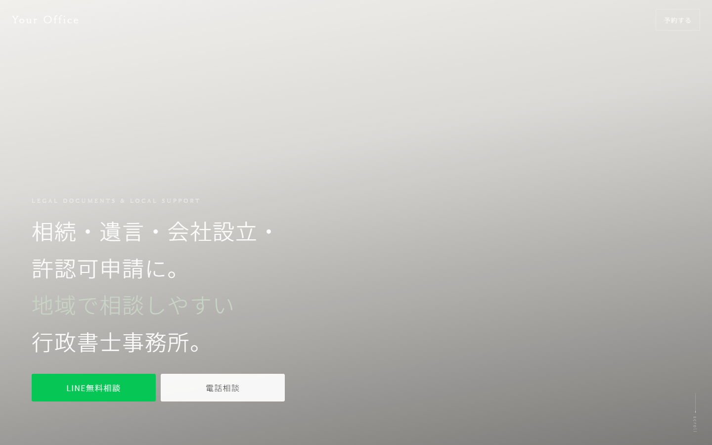
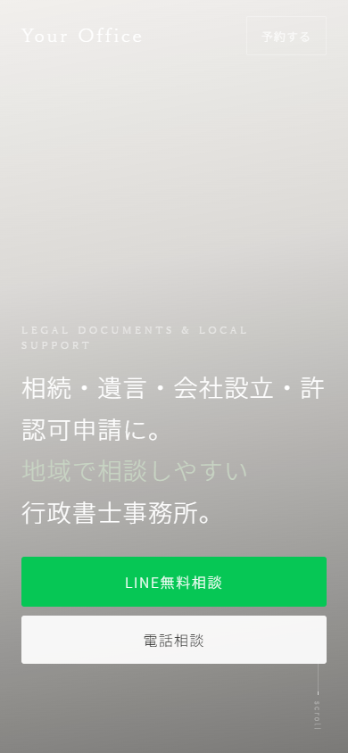

# Administrative Scrivener LP

地域密着型の行政書士事務所を想定した、ポートフォリオ用の自主制作ランディングページです。

## Overview

このLPは、行政書士事務所に初めて相談するユーザーが「どの手続きを依頼できるのか」「安心して相談できそうか」「問い合わせるにはどうすればよいか」を短時間で判断できる状態を目指して制作しました。

相続・遺言・会社設立・許認可申請・補助金申請など、利用者にとって分かりづらくなりやすい業務を整理し、相談までの導線を1ページ内で分かりやすく案内する構成にしています。

## Demo

TODO: 公開URLを追加

## Screenshots

### Desktop



### Mobile



## Project Goal

地域の行政書士事務所が、初めて訪れたユーザーに対して「安心して相談したい」「問い合わせてみたい」と感じてもらうことを目的とした自主制作LPです。

目的は、見た目のデザインだけで印象づけることではありません。行政書士事務所に必要な信頼感、専門性、相談までの導線、業務内容の分かりやすさを改善することを重視しました。

特に、スマートフォンで閲覧するユーザーが多いことを想定し、ファーストビュー、対応業務、無料相談導線、お客様の声、相談事例、事務所情報を1ページ内に整理しています。

## Design Thinking

### 想定クライアント

- 地域密着型の行政書士事務所
- 個人開業の行政書士
- 中小企業・個人を主な顧客とする事務所

### 想定ユーザー

- 相続や遺言の手続きに不安を抱える個人
- 会社設立や許認可申請を進めたい個人事業主・中小企業
- 補助金申請や契約書作成など、書類手続きの相談先を探している事業者

### 想定課題

- どのような手続きを依頼できるのか分かりづらい
- 初めて相談する人の心理的ハードルが高い
- 専門用語が多く内容を理解しにくい
- 問い合わせまでの導線が弱い
- スマートフォンで閲覧した際に情報が整理されていない

これらの課題は、行政書士の業務範囲が広く、利用者側が「自分の相談内容が対象になるのか」を判断しにくいことが原因だと仮定しました。

また、相続・許認可・会社設立などの手続きは専門用語が多く、初めて相談する人ほど不安を感じやすい領域です。そのため、制度や手続きの詳細を長く説明するよりも、まず「相談できる内容」「進め方」「問い合わせ先」を分かりやすく提示することを優先しました。

### 改善施策

#### 1. ファーストビューで対応業務を明確化

ファーストビューでは、相続・遺言・会社設立・許認可申請といった主要サービスを最初に伝える構成にしました。

行政書士事務所を探しているユーザーは、最初に「この事務所は自分の相談に対応しているか」を確認します。そのため、対応業務を冒頭で明確にし、読み進める理由を作ることを狙っています。

#### 2. 信頼性を高める情報設計

取扱業務、お客様の声、相談事例・サポート内容、事務所情報、対応エリアが分かるアクセス情報を整理して掲載しました。

行政書士への相談は、手続きの正確性だけでなく「丁寧に説明してくれそうか」「初めてでも相談しやすいか」が判断材料になります。そのため、サービス一覧だけでなく、相談後のイメージが持てる情報を配置し、心理的な不安を下げる構成にしています。

なお、サイト内のお客様の声・評価数・報酬目安はポートフォリオ用のサンプルです。実在する事務所の実績や成果を示すものではありません。

#### 3. 相談導線の改善

LINE無料相談、電話相談、Instagram、画面下部の固定CTAを配置しました。

行政書士に相談するユーザーは、電話で直接話したい人もいれば、まずは文章で相談内容を送ってみたい人もいます。そのため、複数の相談手段を用意し、ユーザーの心理状態や検討段階に合わせて問い合わせやすい導線にしました。

#### 4. 専門用語をできるだけ避けた情報設計

取扱業務や相談事例は、専門的な制度説明よりも「何をサポートするのか」が伝わる表現を優先しました。

初めて相談する利用者にとって、難しい用語が多いサイトは離脱の原因になりやすいと考えました。そのため、業務名、補足説明、報酬目安、問い合わせ方法を短く整理し、スマートフォンでも迷わず読み進められる構成を意識しています。

### Expected Outcome

本作品は自主制作のため、実際の運用データや改善実績はありません。

一般的なWeb改善・UI/UX・導線設計の考え方にもとづき、以下のような成果を狙った設計としています。

- 問い合わせ率の向上が期待される
- 相談への心理的ハードル低下が想定される
- サービス内容の理解向上を狙う
- スマートフォン閲覧時の離脱率低減につながるという仮説

## Features

- スマートフォン優先のレスポンシブデザイン
- LINE無料相談、電話相談、Instagram導線
- 画面下部の固定CTA
- 相続・遺言・会社設立・許認可申請などの取扱業務一覧
- お客様の声、相談事例・サポート内容、事務所情報、Google Mapセクション
- HTML/CSS/JavaScriptのみで動作
- Vercel / Netlify / GitHub Pages にそのまま公開可能

## Tech Stack

- HTML
- CSS
- JavaScript
- Google Fonts
- Unsplash images
- Google Maps embed

## Local Development

このリポジトリは静的HTMLで構成されています。

### Browser Preview

`index.html` をブラウザで開くと確認できます。

### Local Server

必要に応じて、任意のローカルサーバーで確認できます。

```bash
python -m http.server 3000
```

ブラウザで `http://localhost:3000` を開いてください。

## Customization

以下の項目を実際の行政書士事務所の情報に差し替えることで、事務所向けLPとして利用できます。

| 項目 | 検索する文字 | 変更例 |
|---|---|---|
| 事務所名 | `Your Office` / `Gyoseishoshi Office` | `〇〇行政書士事務所` |
| 電話番号 | `000-0000-0000` / `0000000000` | `03-1234-5678` / `0312345678` |
| LINE | `@your_line_id` | `@sample_office` |
| Instagram | `your_account` | `sample_office` |
| 住所 | `東京都中央区銀座1-2-3` | 実際の住所 |
| 取扱業務 | `相続手続きサポート` など | 事務所の取扱業務 |
| 報酬目安 | `¥33,000` など | 事務所の料金表記 |
| 受付時間 | `平日 10:00〜19:00` など | 実際の受付時間 |
| お客様の声 | サンプル文 | 掲載許可済みの内容 |

## Google Map

このテンプレートではAPIキー不要の埋め込みURLを使っています。

```html
https://www.google.com/maps?q=東京都中央区銀座1-2-3&output=embed
```

住所部分を事務所住所に変更してください。道案内ボタン側のURLも同じ住所へ差し替えると自然です。

## Note

この作品はポートフォリオ用の自主制作です。実在する行政書士事務所の実績や運用データにもとづくものではありません。

課題設定、改善施策、成果仮説は、一般的なWeb改善・UI/UX・導線設計の考え方をもとに制作しています。実際の問い合わせ増加や成果を保証するものではありません。

画像はUnsplashの外部画像を使用しています。商用利用時は必要に応じて事務所の写真に差し替えてください。電話番号、LINE、Instagram、住所、受付時間、報酬目安、お客様の声、評価数はサンプルです。実際に公開する場合は、必ず実データに差し替え、掲載許可や表記ルールを確認してください。

「必ず許可が取れる」「補助金が必ず採択される」などの断定表現は避けてください。また、法律相談そのものではなく、行政書士の業務範囲に合う書類作成・申請手続きのサポート表現に調整してください。

## License

MIT License

## Related Templates

- [美容院向けLPテンプレート](https://github.com/nyanjii-hub/local-business-lp-template)
- [整体院向けLPテンプレート](https://github.com/nyanjii-hub/local-business-lp-template-seitai)

## Created with

ChatGPT / Claude Code / Codex などのAI開発支援ツールを活用して作成・改善できます。
